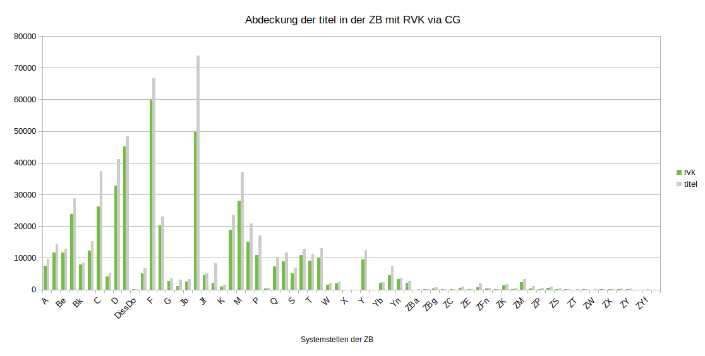

# Abdeckung der Titel in der Zentralbibliothek (ZB, DE-290-0) mit RVK-Notationen via CultureGraph

Quelldaten: [data/DE-290-0.tsv](data/DE-290-0.tsv)

| **collection** | **titles** | **bundles** | **no bundle** | **quota bundles** | **rvk** | **no rvk** | **quota rvk** |
| -------------- | ---------- | ----------- | ------------- | ----------------- | ------- | ---------- | ------------- |
| **A**          | 9.770       | 7.867        | 1.903          | 80,52             | 7.452    | 2.318       | **76,27**     |
| **Ba**         | 14.505      | 11.863       | 2.642          | 81,79             | 11.691   | 2.814       | **80,6**      |
| **Be**         | 12.793      | 11.873       | 920           | 92,81             | 11.716   | 1.077       | **91,58**     |
| **Bg**         | 28.756      | 25.077       | 3.679          | 87,21             | 23.880   | 4.876       | **83,04**     |
| **Bk**         | 8.488       | 8.047        | 441           | 94,8              | 7.820    | 668        | **92,13**     |
| **Bt**         | 15.282      | 12.671       | 2.611          | 82,91             | 12.195   | 3.087       | **79,8**      |
| **C**          | 37.431      | 27.320       | 10.111         | 72,99             | 26.136   | 11.295      | **69,82**     |
| **Cp**         | 5.031       | 4.622        | 409           | 91,87             | 4.194    | 837        | **83,36**     |
| **D**          | 41.139      | 33.970       | 7.169          | 82,57             | 32.850   | 8.289       | **79,85**     |
| **Diss**       | 48.257      | 47.887       | 370           | 99,23             | 45.117   | 3.140       | **93,49**     |
| **DissDo**     | 95         | 93          | 2             | 97,89             | 89      | 6          | **93,68**     |
| **E**          | 6.724       | 5.565        | 1.159          | 82,76             | 5.091    | 1.633       | **75,71**     |
| **F**          | 66.620      | 62.145       | 4.475          | 93,28             | 59.856   | 6.764       | **89,85**     |
| **Fn**         | 23.121      | 20.903       | 2.218          | 90,41             | 20.282   | 2.839       | **87,72**     |
| **G**          | 3.404       | 2.666        | 738           | 78,32             | 2.619    | 785        | **76,94**     |
| **HB**         | 3.016       | 1.344        | 1.672          | 44,56             | 1.131    | 1.885       | **37,5**      |
| **Jb**         | 3.260       | 3.021        | 239           | 92,67             | 2.486    | 774        | **76,26**     |
| **Jc**         | 73.817      | 58.810       | 15.007         | 79,67             | 49.682   | 24.135      | **67,3**      |
| **Jf**         | 5.189       | 4.915        | 274           | 94,72             | 4.522    | 667        | **87,15**     |
| **Js**         | 8.202       | 3.112        | 5.090          | 37,94             | 2132    | 6.070       | **25,99**     |
| **K**          | 1.504       | 1.025        | 479           | 68,15             | 946     | 558        | **62,9**      |
| **L**          | 23.539      | 20.228       | 3.311          | 85,93             | 18.800   | 4.739       | **79,87**     |
| **M**          | 36.999      | 29.383       | 7.616          | 79,42             | 28.034   | 8.965       | **75,77**     |
| **N**          | 20.810      | 16.509       | 4.301          | 79,33             | 15.139   | 5.671       | **72,75**     |
| **P**          | 17.125      | 11.600       | 5.525          | 67,74             | 10.804   | 6.321       | **63,09**     |
| **PA**         | 445        | 320         | 125           | 71,91             | 315     | 130        | **70,79**     |
| **Q**          | 10.373      | 8.129        | 2.244          | 78,37             | 7.333    | 3.040       | **70,69**     |
| **Rara**       | 11.742      | 9.910        | 1.832          | 84,4              | 8.833    | 2.909       | **75,23**     |
| **S**          | 6.863       | 5.604        | 1.259          | 81,66             | 5.020    | 1.843       | **73,15**     |
| **Sn**         | 12.797      | 11.320       | 1.477          | 88,46             | 10.850   | 1.947       | **84,79**     |
| **T**          | 11.179      | 9.753        | 1.426          | 87,24             | 9.056    | 2.123       | **81,01**     |
| **V**          | 13.042      | 10.875       | 2.167          | 83,38             | 10.131   | 2.911       | **77,68**     |
| **W**          | 2.047       | 1.644        | 403           | 80,31             | 1.419    | 628        | **69,32**     |
| **Wn**         | 2.573       | 2.114        | 459           | 82,16             | 1.873    | 700        | **72,79**     |
| **X**          | 12         | 5           | 7             | 41,67             | 5       | 7          | **41,67**     |
| **Xn**         | 3          | 3           | 0             | 100               | 3       | 0          | **100**       |
| **Y**          | 12.547      | 10.404       | 2.143          | 82,92             | 9.567    | 2.980       | **76,25**     |
| **Ya**         | 3          | 2           | 1             | 66,67             | 2       | 1          | **66,67**     |
| **Yb**         | 2.334       | 2.202        | 132           | 94,34             | 2.048    | 286        | **87,75**     |
| **Yf**         | 7.429       | 4.710        | 2.719          | 63,4              | 4.440    | 2.989       | **59,77**     |
| **Yn**         | 3.730       | 3.427        | 303           | 91,88             | 3.237    | 493        | **86,78**     |
| **ZA**         | 2.640       | 2.279        | 361           | 86,33             | 2.132    | 508        | **80,76**     |
| **ZBa**        | 31         | 2           | 29            | 6,45              | 0       | 31         | **0**         |
| **ZBe**        | 77         | 69          | 8             | 89,61             | 37      | 40         | **48,05**     |
| **ZBg**        | 655        | 418         | 237           | 63,82             | 271     | 384        | **41,37**     |
| **ZBt**        | 93         | 59          | 34            | 63,44             | 59      | 34         | **63,44**     |
| **ZC**         | 210        | 149         | 61            | 70,95             | 115     | 95         | **54,76**     |
| **ZD**         | 823        | 682         | 141           | 82,87             | 616     | 207        | **74,85**     |
| **ZE**         | 218        | 104         | 114           | 47,71             | 74      | 144        | **33,94**     |
| **ZF**         | 1.953       | 950         | 1.003          | 48,64             | 679     | 1.274       | **34,77**     |
| **ZFn**        | 465        | 378         | 87            | 81,29             | 281     | 184        | **60,43**     |
| **ZG**         | 104        | 51          | 53            | 49,04             | 46      | 58         | **44,23**     |
| **ZK**         | 1.724       | 1.535        | 189           | 89,04             | 1.309    | 415        | **75,93**     |
| **ZL**         | 432        | 239         | 193           | 55,32             | 202     | 230        | **46,76**     |
| **ZM**         | 3.250       | 2.832        | 418           | 87,14             | 2.268    | 982        | **69,78**     |
| **ZN**         | 1.045       | 883         | 162           | 84,5              | 369     | 676        | **35,31**     |
| **ZP**         | 517        | 275         | 242           | 53,19             | 151     | 366        | **29,21**     |
| **ZQ**         | 859        | 615         | 244           | 71,59             | 524     | 335        | **61**        |
| **ZS**         | 351        | 317         | 34            | 90,31             | 100     | 251        | **28,49**     |
| **ZSn**        | 178        | 118         | 60            | 66,29             | 45      | 133        | **25,28**     |
| **ZT**         | 58         | 41          | 17            | 70,69             | 12      | 46         | **20,69**     |
| **ZV**         | 208        | 158         | 50            | 75,96             | 136     | 72         | **65,38**     |
| **ZW**         | 21         | 7           | 14            | 33,33             | 5       | 16         | **23,81**     |
| **ZWn**        | 69         | 52          | 17            | 75,36             | 31      | 38         | **44,93**     |
| **ZX**         | 86         | 41          | 45            | 47,67             | 24      | 62         | **27,91**     |
| **ZXn**        | 239        | 110         | 129           | 46,03             | 69      | 170        | **28,87**     |
| **ZY**         | 269        | 229         | 40            | 85,13             | 203     | 66         | **75,46**     |
| **ZYX**        | 2          | 0           | 2             | 0                 | 0       | 2          | **0**         |
| **ZYf**        | 31         | 17          | 14            | 54,84             | 4       | 27         | **12,9**      |
| **ZYn**        | 11         | 8           | 3             | 72,73             | 3       | 8          | **27,27**     |

Bilddatei: [img/CG_RVK_DE-290-0.png](img/CG_RVK_DE-290-0.png)

---

This work is licensed under a [Creative Commons Attribution 4.0 International License](https://creativecommons.org/licenses/by/4.0/).
