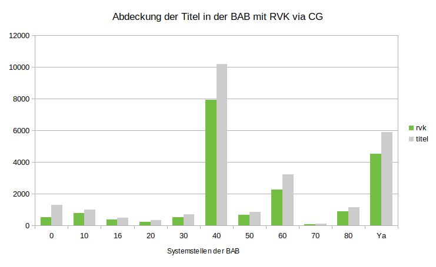

# Abdeckung der Titel in der Bereichsbibliothek Bauwesen und Architektur (BAB, DE-290-10) mit RVK-Notationen via CultureGraph

Quelldaten: [data/DE-290-10.tsv](data/DE-290-10.tsv)

| **collection** | **titles** | **bundles** | **no bundle** | **quota bundles** | **rvk** | **no rvk** | **quota rvk** |
| -------------- | ---------- | ----------- | ------------- | ----------------- | ------- | ---------- | ------------- |
| **0**          | 1.315       | 684         | 631           | 52,02             | 526     | 789        | **40**        |
| **10**         | 1.003       | 860         | 143           | 85,74             | 795     | 208        | **79,26**     |
| **16**         | 477        | 401         | 76            | 84,07             | 364     | 113        | **76,31**     |
| **20**         | 330        | 246         | 84            | 74,55             | 237     | 93         | **71,82**     |
| **30**         | 693        | 567         | 126           | 81,82             | 520     | 173        | **75,04**     |
| **40**         | 10.190      | 8.540        | 1.650          | 83,81             | 7.933    | 2.257       | **77,85**     |
| **50**         | 856        | 738         | 118           | 86,21             | 664     | 192        | **77,57**     |
| **60**         | 3.224       | 2.504        | 720           | 77,67             | 2.249    | 975        | **69,76**     |
| **70**         | 132        | 107         | 25            | 81,06             | 98      | 34         | **74,24**     |
| **80**         | 1.146       | 957         | 189           | 83,51             | 904     | 242        | **78,88**     |
| **Ya**         | 5.885       | 5.109        | 776           | 86,81             | 4.535    | 1.350       | **77,06**     |

Bilddatei: [img/CG_RVK_DE-290-10.png](img/CG_RVK_DE-290-10.png)

---

This work is licensed under a [Creative Commons Attribution 4.0 International License](https://creativecommons.org/licenses/by/4.0/).
