# Abdeckung der Titel in der Emil-Figge-Bibliothek (EFB, DE-290-12) mit RVK-Notationen via CultureGraph

Quelldaten: [data/DE-290-12.tsv](data/DE-290-12.tsv)

## Systemstellen A*

| **collection** | **titles** | **bundles** | **no bundle** | **quota bundles** | **rvk** | **no rvk** | **quota rvk** |
| -------------- | ---------- | ----------- | ------------- | ----------------- | ------- | ---------- | ------------- |
| **A 100**      | 26         | 26          | 0             | 100               | 25      | 1          | **96,15**     |
| **A 300**      | 178        | 158         | 20            | 88,76             | 153     | 25         | **85,96**     |
| **A 500**      | 283        | 250         | 33            | 88,34             | 246     | 37         | **86,93**     |
| **A 700**      | 50         | 47          | 3             | 94                | 46      | 4          | **92**        |
| **A 800**      | 258        | 248         | 10            | 96,12             | 243     | 15         | **94,19**     |
| **AA**         | 487        | 312         | 175           | 64,07             | 301     | 186        | **61,81**     |
| **ASP**        | 2.717       | 2.430        | 287           | 89,44             | 2.304    | 413        | **84,8**      |

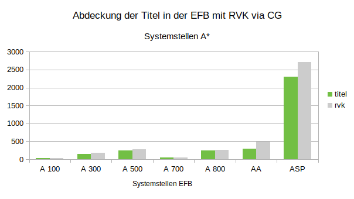

Bilddatei: [img/CG_RVK_DE-290-12_A.png](img/CG_RVK_DE-290-12_A.png)

## Systemstellen GE*

| **collection** | **titles** | **bundles** | **no bundle** | **quota bundles** | **rvk** | **no rvk** | **quota rvk** |
| -------------- | ---------- | ----------- | ------------- | ----------------- | ------- | ---------- | ------------- |
| **GE**         | 10.136      | 7.660        | 2.476          | 75,57             | 7.352    | 2.784       | **72,53**     |
| **GEA**        | 749        | 486         | 263           | 64,89             | 480     | 269        | **64,09**     |
| **GEB**        | 314        | 172         | 142           | 54,78             | 171     | 143        | **54,46**     |
| **GEC**        | 515        | 409         | 106           | 79,42             | 398     | 117        | **77,28**     |
| **GED**        | 482        | 269         | 213           | 55,81             | 264     | 218        | **54,77**     |
| **GEE**        | 780        | 619         | 161           | 79,36             | 613     | 167        | **78,59**     |
| **GEF**        | 778        | 659         | 119           | 84,7              | 652     | 126        | **83,8**      |
| **GEG**        | 250        | 207         | 43            | 82,8              | 198     | 52         | **79,2**      |
| **GEH**        | 569        | 432         | 137           | 75,92             | 416     | 153        | **73,11**     |
| **GEI**        | 232        | 219         | 13            | 94,4              | 210     | 22         | **90,52**     |
| **GEK**        | 492        | 425         | 67            | 86,38             | 410     | 82         | **83,33**     |
| **GEL**        | 167        | 136         | 31            | 81,44             | 129     | 38         | **77,25**     |
| **GEM**        | 485        | 409         | 76            | 84,33             | 397     | 88         | **81,86**     |
| **GEN**        | 1.194       | 1.067        | 127           | 89,36             | 1.038    | 156        | **86,93**     |
| **GEP**        | 270        | 212         | 58            | 78,52             | 204     | 66         | **75,56**     |
| **GEQ**        | 1.827       | 1.403        | 424           | 76,79             | 1.259    | 568        | **68,91**     |
| **GET**        | 628        | 221         | 407           | 35,19             | 206     | 422        | **32,8**      |
| **GEU**        | 404        | 315         | 89            | 77,97             | 307     | 97         | **75,99**     |

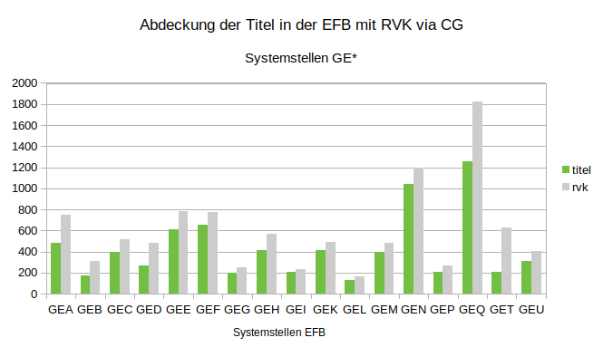

Bilddatei: [img/CG_RVK_DE-290-12_GE.png](img/CG_RVK_DE-290-12_GE.png)

## Systemstellen GO*

| **collection** | **titles** | **bundles** | **no bundle** | **quota bundles** | **rvk** | **no rvk** | **quota rvk** |
| -------------- | ---------- | ----------- | ------------- | ----------------- | ------- | ---------- | ------------- |
| **GO**         | 5.898       | 4.860        | 1.038          | 82,4              | 4.698    | 1.200       | **79,65**     |
| **GOA**        | 582        | 305         | 277           | 52,41             | 273     | 309        | **46,91**     |
| **GOB**        | 66         | 64          | 2             | 96,97             | 64      | 2          | **96,97**     |
| **GOC**        | 82         | 66          | 16            | 80,49             | 63      | 19         | **76,83**     |
| **GOD**        | 595        | 519         | 76            | 87,23             | 512     | 83         | **86,05**     |
| **GOE**        | 876        | 806         | 70            | 92,01             | 795     | 81         | **90,75**     |
| **GOF**        | 28         | 22          | 6             | 78,57             | 22      | 6          | **78,57**     |
| **GOG**        | 553        | 500         | 53            | 90,42             | 488     | 65         | **88,25**     |
| **GOH**        | 932        | 847         | 85            | 90,88             | 822     | 110        | **88,2**      |
| **GOI**        | 675        | 587         | 88            | 86,96             | 551     | 124        | **81,63**     |
| **GOK**        | 238        | 174         | 64            | 73,11             | 168     | 70         | **70,59**     |
| **GOL**        | 328        | 301         | 27            | 91,77             | 294     | 34         | **89,63**     |
| **GOM**        | 75         | 69          | 6             | 92                | 68      | 7          | **90,67**     |
| **GON**        | 145        | 135         | 10            | 93,1              | 131     | 14         | **90,34**     |
| **GOO**        | 130        | 119         | 11            | 91,54             | 117     | 13         | **90**        |
| **GOP**        | 16         | 16          | 0             | 100               | 15      | 1          | **93,75**     |
| **GOQ**        | 6          | 6           | 0             | 100               | 6       | 0          | **100**       |
| **GOR**        | 384        | 302         | 82            | 78,65             | 290     | 94         | **75,52**     |
| **GOS**        | 187        | 22          | 165           | 11,76             | 19      | 168        | **10,16**     |

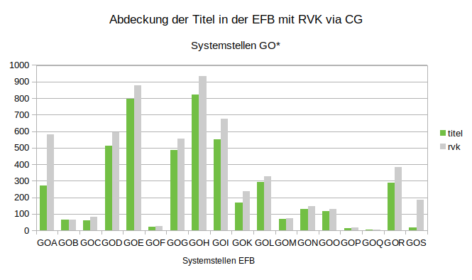

Bilddatei: [img/CG_RVK_DE-290-12_GO.png](img/CG_RVK_DE-290-12_GO.png)

## Systemstellen JO*

| **collection** | **titles** | **bundles** | **no bundle** | **quota bundles** | **rvk** | **no rvk** | **quota rvk** |
| -------------- | ---------- | ----------- | ------------- | ----------------- | ------- | ---------- | ------------- |
| **JO**         | 8.310       | 7.494        | 816           | 90,18             | 6.915    | 1.395       | **83,21**     |
| **JOA**        | 335        | 215         | 120           | 64,18             | 190     | 145        | **56,72**     |
| **JOB**        | 169        | 155         | 14            | 91,72             | 150     | 19         | **88,76**     |
| **JOD**        | 305        | 264         | 41            | 86,56             | 259     | 46         | **84,92**     |
| **JOE**        | 374        | 341         | 33            | 91,18             | 316     | 58         | **84,49**     |
| **JOF**        | 172        | 138         | 34            | 80,23             | 133     | 39         | **77,33**     |
| **JOH**        | 1.295       | 1.201        | 94            | 92,74             | 1.142    | 153        | **88,19**     |
| **JOK**        | 2.730       | 2.453        | 277           | 89,85             | 2.216    | 514        | **81,17**     |
| **JOL**        | 673        | 632         | 41            | 93,91             | 589     | 84         | **87,52**     |
| **JOM**        | 1.174       | 1.090        | 84            | 92,84             | 1.017    | 157        | **86,63**     |
| **JOO**        | 468        | 440         | 28            | 94,02             | 380     | 88         | **81,2**      |
| **JOR**        | 390        | 369         | 21            | 94,62             | 341     | 49         | **87,44**     |
| **JOT**        | 225        | 196         | 29            | 87,11             | 182     | 43         | **80,89**     |

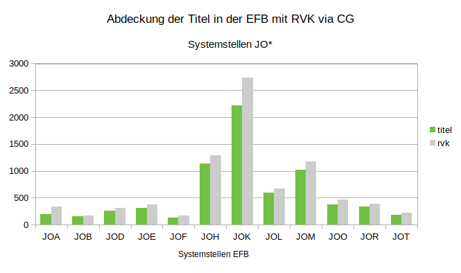

Bilddatei: [img/CG_RVK_DE-290-12_JO.png](img/CG_RVK_DE-290-12_JO.png)

## Systemstellen K*

| **collection** | **titles** | **bundles** | **no bundle** | **quota bundles** | **rvk** | **no rvk** | **quota rvk** |
| -------------- | ---------- | ----------- | ------------- | ----------------- | ------- | ---------- | ------------- |
| **K**          | 9.310       | 8.227        | 1.083          | 88,37             | 7.750    | 1.560       | **83,24**     |
| **KB**         | 207        | 53          | 154           | 25,6              | 53      | 154        | **25,6**      |
| **KC**         | 1.241       | 1.075        | 166           | 86,62             | 1.038    | 203        | **83,64**     |
| **KD**         | 366        | 333         | 33            | 90,98             | 325     | 41         | **88,8**      |
| **KE**         | 104        | 64          | 40            | 61,54             | 62      | 42         | **59,62**     |
| **KF**         | 3.579       | 3.350        | 229           | 93,6              | 3.125    | 454        | **87,31**     |
| **KG**         | 557        | 486         | 71            | 87,25             | 463     | 94         | **83,12**     |
| **KHa**        | 30         | 24          | 6             | 80                | 22      | 8          | **73,33**     |
| **KHs**        | 4          | 4           | 0             | 100               | 4       | 0          | **100**       |
| **KJ**         | 153        | 138         | 15            | 90,2              | 132     | 21         | **86,27**     |
| **KK**         | 79         | 78          | 1             | 98,73             | 74      | 5          | **93,67**     |
| **KL**         | 153        | 120         | 33            | 78,43             | 118     | 35         | **77,12**     |
| **KM**         | 25         | 25          | 0             | 100               | 25      | 0          | **100**       |
| **KN**         | 11         | 11          | 0             | 100               | 10      | 1          | **90,91**     |
| **KOa**        | 2          | 2           | 0             | 100               | 2       | 0          | **100**       |
| **KOr**        | 45         | 40          | 5             | 88,89             | 37      | 8          | **82,22**     |
| **KP**         | 2          | 2           | 0             | 100               | 2       | 0          | **100**       |
| **KPa**        | 13         | 11          | 2             | 84,62             | 11      | 2          | **84,62**     |
| **KPc**        | 28         | 24          | 4             | 85,71             | 22      | 6          | **78,57**     |
| **KPf**        | 6          | 6           | 0             | 100               | 5       | 1          | **83,33**     |
| **KPs**        | 45         | 43          | 2             | 95,56             | 39      | 6          | **86,67**     |
| **KPv**        | 2          | 2           | 0             | 100               | 2       | 0          | **100**       |
| **KQ**         | 484        | 420         | 64            | 86,78             | 393     | 91         | **81,2**      |
| **KR**         | 66         | 63          | 3             | 95,45             | 63      | 3          | **95,45**     |
| **KS**         | 348        | 294         | 54            | 84,48             | 282     | 66         | **81,03**     |
| **KT**         | 20         | 10          | 10            | 50                | 8       | 12         | **40**        |
| **KU**         | 199        | 185         | 14            | 92,96             | 159     | 40         | **79,9**      |
| **KV**         | 111        | 102         | 9             | 91,89             | 100     | 11         | **90,09**     |
| **KW**         | 160        | 156         | 4             | 97,5              | 154     | 6          | **96,25**     |
| **KX**         | 828        | 736         | 92            | 88,89             | 685     | 143        | **82,73**     |
| **KY**         | 28         | 20          | 8             | 71,43             | 2       | 26         | **7,14**      |
| **KZSK**       | 413        | 349         | 64            | 84,5              | 333     | 80         | **80,63**     |
| **KZVK**       | 1          | 1           | 0             | 100               | 0       | 1          | **0**         |

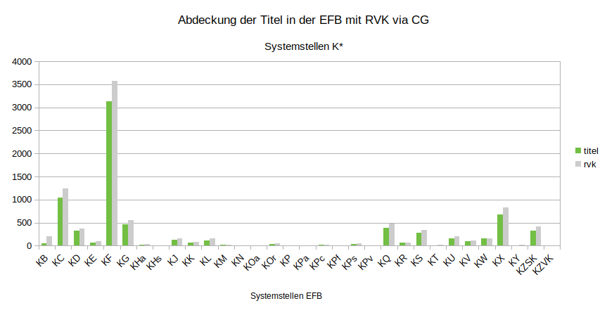

Bilddatei: [img/CG_RVK_DE-290-12_K.png](img/CG_RVK_DE-290-12_K.png)

## Systemstellen LE*

| **collection** | **titles** | **bundles** | **no bundle** | **quota bundles** | **rvk** | **no rvk** | **quota rvk** |
| -------------- | ---------- | ----------- | ------------- | ----------------- | ------- | ---------- | ------------- |
| **LE**         | 4.478       | 4.045        | 433           | 90,33             | 3.903    | 575        | **87,16**     |
| **LEA**        | 868        | 836         | 32            | 96,31             | 826     | 42         | **95,16**     |
| **LEB**        | 75         | 70          | 5             | 93,33             | 64      | 11         | **85,33**     |
| **LEC**        | 394        | 365         | 29            | 92,64             | 362     | 32         | **91,88**     |
| **LED**        | 299        | 283         | 16            | 94,65             | 273     | 26         | **91,3**      |
| **LEE**        | 232        | 194         | 38            | 83,62             | 181     | 51         | **78,02**     |
| **LEF**        | 328        | 268         | 60            | 81,71             | 261     | 67         | **79,57**     |
| **LEG**        | 85         | 60          | 25            | 70,59             | 59      | 26         | **69,41**     |
| **LEH**        | 97         | 82          | 15            | 84,54             | 72      | 25         | **74,23**     |
| **LEJ**        | 122        | 112         | 10            | 91,8              | 112     | 10         | **91,8**      |
| **LEK**        | 66         | 54          | 12            | 81,82             | 54      | 12         | **81,82**     |
| **LEL**        | 701        | 617         | 84            | 88,02             | 592     | 109        | **84,45**     |
| **LEM**        | 205        | 187         | 18            | 91,22             | 175     | 30         | **85,37**     |
| **LEN**        | 129        | 121         | 8             | 93,8              | 113     | 16         | **87,6**      |
| **LEO**        | 331        | 319         | 12            | 96,37             | 305     | 26         | **92,15**     |
| **LEP**        | 43         | 41          | 2             | 95,35             | 39      | 4          | **90,7**      |
| **LEQ**        | 223        | 210         | 13            | 94,17             | 205     | 18         | **91,93**     |
| **LER**        | 94         | 74          | 20            | 78,72             | 73      | 21         | **77,66**     |
| **LES**        | 1          | 0           | 1             | 0                 | 0       | 1          | **0**         |
| **LET**        | 64         | 52          | 12            | 81,25             | 48      | 16         | **75**        |
| **LEV**        | 40         | 31          | 9             | 77,5              | 30      | 10         | **75**        |
| **LEW**        | 43         | 33          | 10            | 76,74             | 23      | 20         | **53,49**     |
| **LEX**        | 38         | 36          | 2             | 94,74             | 36      | 2          | **94,74**     |

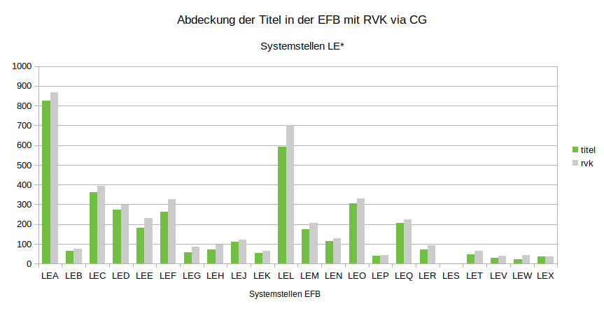

Bilddatei: [img/CG_RVK_DE-290-12_LE.png](img/CG_RVK_DE-290-12_LE.png)

## Systemstellen MU*

| **collection** | **titles** | **bundles** | **no bundle** | **quota bundles** | **rvk** | **no rvk** | **quota rvk** |
| -------------- | ---------- | ----------- | ------------- | ----------------- | ------- | ---------- | ------------- |
| **MU**         | 13.644      | 6.253        | 7.391          | 45,83             | 5.788    | 7.856       | **42,42**     |
| **MUA**        | 349        | 141         | 208           | 40,4              | 136     | 213        | **38,97**     |
| **MUB**        | 173        | 163         | 10            | 94,22             | 163     | 10         | **94,22**     |
| **MUC**        | 5          | 3           | 2             | 60                | 3       | 2          | **60**        |
| **MUD**        | 95         | 90          | 5             | 94,74             | 76      | 19         | **80**        |
| **MUE**        | 394        | 328         | 66            | 83,25             | 312     | 82         | **79,19**     |
| **MUF**        | 977        | 404         | 573           | 41,35             | 387     | 590        | **39,61**     |
| **MUG**        | 727        | 635         | 92            | 87,35             | 624     | 103        | **85,83**     |
| **MUH**        | 255        | 203         | 52            | 79,61             | 196     | 59         | **76,86**     |
| **MUJ**        | 92         | 77          | 15            | 83,7              | 74      | 18         | **80,43**     |
| **MUK**        | 460        | 377         | 83            | 81,96             | 369     | 91         | **80,22**     |
| **MUL**        | 414        | 314         | 100           | 75,85             | 308     | 106        | **74,4**      |
| **MUM**        | 978        | 802         | 176           | 82                | 786     | 192        | **80,37**     |
| **MUN**        | 852        | 730         | 122           | 85,68             | 712     | 140        | **83,57**     |
| **MUO**        | 514        | 390         | 124           | 75,88             | 378     | 136        | **73,54**     |
| **MUP**        | 576        | 476         | 100           | 82,64             | 450     | 126        | **78,12**     |
| **MUR**        | 141        | 91          | 50            | 64,54             | 86      | 55         | **60,99**     |
| **MUS**        | 91         | 72          | 19            | 79,12             | 69      | 22         | **75,82**     |
| **MUT**        | 575        | 434         | 141           | 75,48             | 410     | 165        | **71,3**      |
| **MUU**        | 1.015       | 33          | 982           | 3,25              | 18      | 997        | **1,77**      |
| **MUV**        | 1.010       | 42          | 968           | 4,16              | 23      | 987        | **2,28**      |
| **MUW**        | 689        | 110         | 579           | 15,97             | 77      | 612        | **11,18**     |
| **MUX**        | 1.274       | 36          | 1.238          | 2,83              | 12      | 1.262       | **0,94**      |
| **MUY**        | 1.988       | 302         | 1.686          | 15,19             | 119     | 1.869       | **5,99**      |

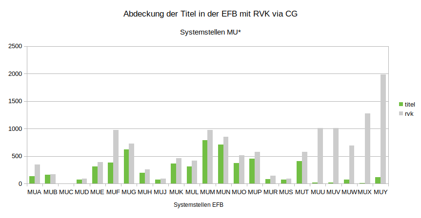

Bilddatei: [img/CG_RVK_DE-290-12_MU.png](img/CG_RVK_DE-290-12_MU.png)

## Systemstellen PA*-PG*

| **collection** | **titles** | **bundles** | **no bundle** | **quota bundles** | **rvk** | **no rvk** | **quota rvk** |
| -------------- | ---------- | ----------- | ------------- | ----------------- | ------- | ---------- | ------------- |
| **P**          | 46.640      | 42.223       | 4.417          | 90,53             | 40.698   | 5.942       | **87,26**     |
| **PA**         | 445        | 320         | 125           | 71,91             | 315     | 130        | **70,79**     |
| **PB**         | 13.968      | 12.887       | 1.081          | 92,26             | 12.532   | 1.436       | **89,72**     |
| **PC**         | 13.640      | 12.160       | 1.480          | 89,15             | 11.730   | 1.910       | **86**        |
| **PD**         | 1.631       | 1.500        | 131           | 91,97             | 1.465    | 166        | **89,82**     |
| **PE**         | 1.643       | 1.462        | 181           | 88,98             | 1.359    | 284        | **82,71**     |
| **PF**         | 12.542      | 11.666       | 876           | 93,02             | 11.121   | 1.421       | **88,67**     |
| **PG**         | 2.771       | 2.228        | 543           | 80,4              | 2.176    | 595        | **78,53**     |

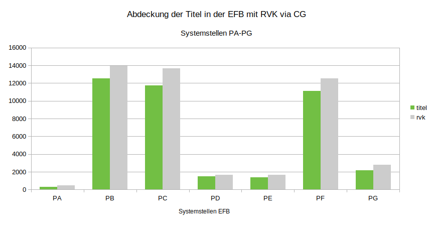

Bilddatei: [img/CG_RVK_DE-290-12_PA-PG.png](img/CG_RVK_DE-290-12_PA-PG.png)

## Systemstellen PH*

| **collection** | **titles** | **bundles** | **no bundle** | **quota bundles** | **rvk** | **no rvk** | **quota rvk** |
| -------------- | ---------- | ----------- | ------------- | ----------------- | ------- | ---------- | ------------- |
| **PH**         | 9.009       | 6.798        | 2.211          | 75,46             | 6.684    | 2.325       | **74,19**     |
| **PHA**        | 50         | 39          | 11            | 78                | 38      | 12         | **76**        |
| **PHB**        | 250        | 170         | 80            | 68                | 169     | 81         | **67,6**      |
| **PHC**        | 421        | 250         | 171           | 59,38             | 248     | 173        | **58,91**     |
| **PHD**        | 190        | 168         | 22            | 88,42             | 161     | 29         | **84,74**     |
| **PHE**        | 145        | 109         | 36            | 75,17             | 109     | 36         | **75,17**     |
| **PHF**        | 997        | 867         | 130           | 86,96             | 865     | 132        | **86,76**     |
| **PHG**        | 654        | 614         | 40            | 93,88             | 609     | 45         | **93,12**     |
| **PHH**        | 200        | 181         | 19            | 90,5              | 178     | 22         | **89**        |
| **PHJ**        | 451        | 377         | 74            | 83,59             | 375     | 76         | **83,15**     |
| **PHK**        | 521        | 483         | 38            | 92,71             | 478     | 43         | **91,75**     |
| **PHL**        | 246        | 220         | 26            | 89,43             | 216     | 30         | **87,8**      |
| **PHM**        | 429        | 399         | 30            | 93,01             | 396     | 33         | **92,31**     |
| **PHN**        | 103        | 53          | 50            | 51,46             | 51      | 52         | **49,51**     |
| **PHO**        | 16         | 15          | 1             | 93,75             | 15      | 1          | **93,75**     |
| **PHP**        | 796        | 543         | 253           | 68,22             | 531     | 265        | **66,71**     |
| **PHQ**        | 220        | 136         | 84            | 61,82             | 135     | 85         | **61,36**     |
| **PHR**        | 47         | 24          | 23            | 51,06             | 23      | 24         | **48,94**     |
| **PHS**        | 574        | 403         | 171           | 70,21             | 393     | 181        | **68,47**     |
| **PHT**        | 1.139       | 584         | 555           | 51,27             | 557     | 582        | **48,9**      |
| **PHU**        | 385        | 249         | 136           | 64,68             | 244     | 141        | **63,38**     |
| **PHV**        | 455        | 372         | 83            | 81,76             | 364     | 91         | **80**        |
| **PHW**        | 100        | 73          | 27            | 73                | 71      | 29         | **71**        |
| **PHX**        | 183        | 109         | 74            | 59,56             | 107     | 76         | **58,47**     |
| **PHY**        | 437        | 360         | 77            | 82,38             | 351     | 86         | **80,32**     |

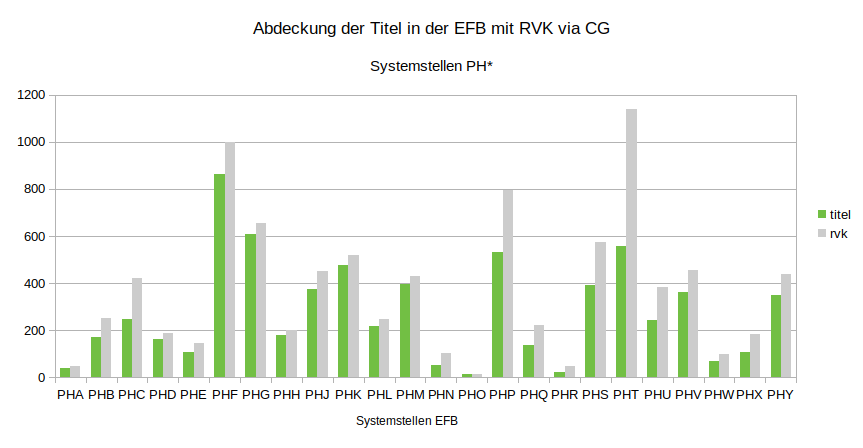

Bilddatei: [img/CG_RVK_DE-290-12_PH.png](img/CG_RVK_DE-290-12_PH.png)

## Systemstellen PO*

| **collection** | **titles** | **bundles** | **no bundle** | **quota bundles** | **rvk** | **no rvk** | **quota rvk** |
| -------------- | ---------- | ----------- | ------------- | ----------------- | ------- | ---------- | ------------- |
| **PO**         | 5.407       | 4.950        | 457           | 91,55             | 4.899    | 508        | **90,6**      |
| **POA**        | 391        | 308         | 83            | 78,77             | 306     | 85         | **78,26**     |
| **POB**        | 157        | 148         | 9             | 94,27             | 148     | 9          | **94,27**     |
| **POC**        | 90         | 76          | 14            | 84,44             | 74      | 16         | **82,22**     |
| **POD**        | 867        | 781         | 86            | 90,08             | 773     | 94         | **89,16**     |
| **POE**        | 94         | 77          | 17            | 81,91             | 77      | 17         | **81,91**     |
| **POF**        | 229        | 215         | 14            | 93,89             | 211     | 18         | **92,14**     |
| **POG**        | 996        | 925         | 71            | 92,87             | 921     | 75         | **92,47**     |
| **POI**        | 122        | 108         | 14            | 88,52             | 103     | 19         | **84,43**     |
| **POK**        | 58         | 58          | 0             | 100               | 58      | 0          | **100**       |
| **POL**        | 48         | 40          | 8             | 83,33             | 40      | 8          | **83,33**     |
| **POM**        | 38         | 27          | 11            | 71,05             | 27      | 11         | **71,05**     |
| **PON**        | 19         | 19          | 0             | 100               | 19      | 0          | **100**       |
| **POO**        | 469        | 436         | 33            | 92,96             | 429     | 40         | **91,47**     |
| **POQ**        | 157        | 143         | 14            | 91,08             | 143     | 14         | **91,08**     |
| **POR**        | 128        | 124         | 4             | 96,88             | 122     | 6          | **95,31**     |
| **POS**        | 186        | 162         | 24            | 87,1              | 162     | 24         | **87,1**      |
| **POT**        | 182        | 180         | 2             | 98,9              | 177     | 5          | **97,25**     |
| **POU**        | 317        | 292         | 25            | 92,11             | 289     | 28         | **91,17**     |
| **POV**        | 129        | 124         | 5             | 96,12             | 122     | 7          | **94,57**     |
| **POW**        | 704        | 681         | 23            | 96,73             | 672     | 32         | **95,45**     |
| **POY**        | 26         | 26          | 0             | 100               | 26      | 0          | **100**       |

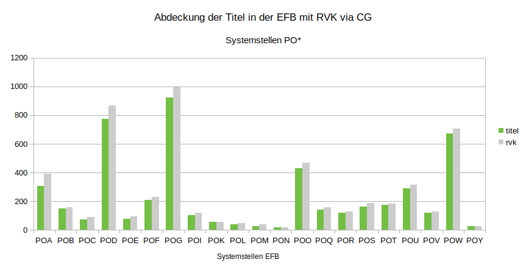

Bilddatei: [img/CG_RVK_DE-290-12_PO.png](img/CG_RVK_DE-290-12_PO.png)

## Systemstellen PS und Reha

| **collection** | **titles** | **bundles** | **no bundle** | **quota bundles** | **rvk** | **no rvk** | **quota rvk** |
| -------------- | ---------- | ----------- | ------------- | ----------------- | ------- | ---------- | ------------- |
| **PS**         | 8.182       | 7.473        | 709           | 91,33             | 7.365    | 817        | **90,01**     |
| **Reha**       | 3.512       | 3.159        | 353           | 89,95             | 3.017    | 495        | **85,91**     |

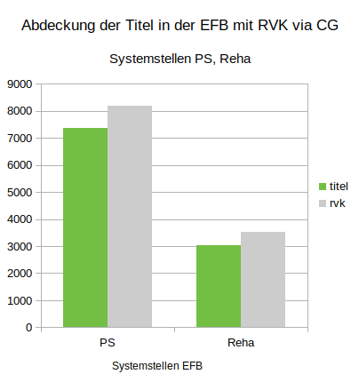

Bilddatei: [img/CG_RVK_DE-290-12_PS_Reha.png](img/CG_RVK_DE-290-12_PS_Reha.png)

## Systemstellen SA*-SC*

| **collection** | **titles** | **bundles** | **no bundle** | **quota bundles** | **rvk** | **no rvk** | **quota rvk** |
| -------------- | ---------- | ----------- | ------------- | ----------------- | ------- | ---------- | ------------- |
| **S**          | 5.233       | 4.478        | 755           | 85,57             | 4.417    | 816        | **84,41**     |
| **SAA**        | 764        | 439         | 325           | 57,46             | 405     | 359        | **53,01**     |
| **SBB**        | 1.353       | 1.240        | 113           | 91,65             | 1.234    | 119        | **91,2**      |
| **SBC**        | 614        | 561         | 53            | 91,37             | 557     | 57         | **90,72**     |
| **SBD**        | 575        | 535         | 40            | 93,04             | 534     | 41         | **92,87**     |
| **SBE**        | 231        | 221         | 10            | 95,67             | 220     | 11         | **95,24**     |
| **SBH**        | 132        | 112         | 20            | 84,85             | 112     | 20         | **84,85**     |
| **SCB**        | 458        | 428         | 30            | 93,45             | 426     | 32         | **93,01**     |
| **SCC**        | 156        | 146         | 10            | 93,59             | 145     | 11         | **92,95**     |
| **SCD**        | 268        | 238         | 30            | 88,81             | 231     | 37         | **86,19**     |
| **SCE**        | 181        | 153         | 28            | 84,53             | 153     | 28         | **84,53**     |
| **SCF**        | 322        | 275         | 47            | 85,4              | 274     | 48         | **85,09**     |
| **SCJ**        | 34         | 34          | 0             | 100               | 34      | 0          | **100**       |
| **SCK**        | 120        | 74          | 46            | 61,67             | 71      | 49         | **59,17**     |
| **SCL**        | 25         | 22          | 3             | 88                | 21      | 4          | **84**        |

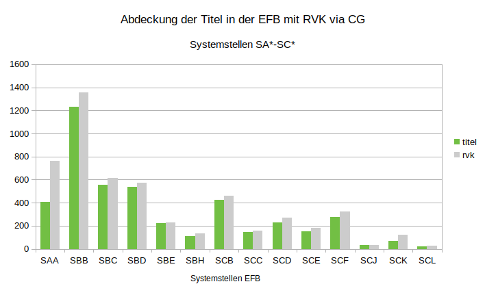

Bilddatei: [img/CG_RVK_DE-290-12_SA-SC.png](img/CG_RVK_DE-290-12_SA-SC.png)

## Systemstellen SD*

| **collection** | **titles** | **bundles** | **no bundle** | **quota bundles** | **rvk** | **no rvk** | **quota rvk** |
| -------------- | ---------- | ----------- | ------------- | ----------------- | ------- | ---------- | ------------- |
| **SD**         | 33.443      | 26.984       | 6459          | 80,69             | 26.577   | 6.866       | **79,47**     |
| **SDA**        | 824        | 399         | 425           | 48,42             | 395     | 429        | **47,94**     |
| **SDC**        | 15.165      | 14.412       | 753           | 95,03             | 14.386   | 779        | **94,86**     |
| **SDD**        | 585        | 413         | 172           | 70,6              | 389     | 196        | **66,5**      |
| **SDE**        | 119        | 78          | 41            | 65,55             | 72      | 47         | **60,5**      |
| **SDF**        | 279        | 133         | 146           | 47,67             | 129     | 150        | **46,24**     |
| **SDG**        | 97         | 54          | 43            | 55,67             | 52      | 45         | **53,61**     |
| **SDH**        | 704        | 288         | 416           | 40,91             | 279     | 425        | **39,63**     |
| **SDI**        | 281        | 158         | 123           | 56,23             | 152     | 129        | **54,09**     |
| **SDJ**        | 373        | 185         | 188           | 49,6              | 179     | 194        | **47,99**     |
| **SDK**        | 552        | 219         | 333           | 39,67             | 210     | 342        | **38,04**     |
| **SDL**        | 571        | 277         | 294           | 48,51             | 271     | 300        | **47,46**     |
| **SDM**        | 103        | 52          | 51            | 50,49             | 49      | 54         | **47,57**     |
| **SDN**        | 709        | 422         | 287           | 59,52             | 405     | 304        | **57,12**     |
| **SDO**        | 351        | 242         | 109           | 68,95             | 238     | 113        | **67,81**     |
| **SDP**        | 3.346       | 2.598        | 748           | 77,64             | 2.545    | 801        | **76,06**     |
| **SDR**        | 2.423       | 2.165        | 258           | 89,35             | 2.044    | 379        | **84,36**     |
| **SDS**        | 1.273       | 1.105        | 168           | 86,8              | 1.090    | 183        | **85,62**     |
| **SDT**        | 129        | 119         | 10            | 92,25             | 117     | 12         | **90,7**      |
| **SDV**        | 2.001       | 1.794        | 207           | 89,66             | 1.782    | 219        | **89,06**     |
| **SDW**        | 216        | 200         | 16            | 92,59             | 191     | 25         | **88,43**     |
| **SDX**        | 282        | 215         | 67            | 76,24             | 209     | 73         | **74,11**     |
| **SDY**        | 1.705       | 1.147        | 558           | 67,27             | 1.124    | 581        | **65,92**     |
| **SDZ**        | 1.355       | 309         | 1.046          | 22,8              | 269     | 1.086       | **19,85**     |

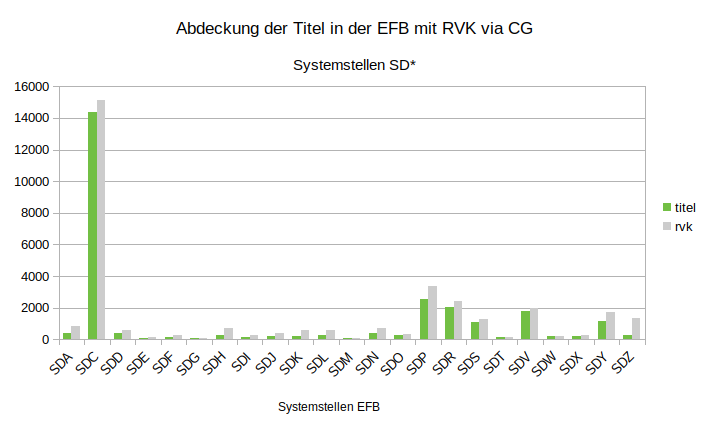

Bilddatei: [img/CG_RVK_DE-290-12_SD.png](img/CG_RVK_DE-290-12_SD.png)

## Systemstellen SE*

| **collection** | **titles** | **bundles** | **no bundle** | **quota bundles** | **rvk** | **no rvk** | **quota rvk** |
| -------------- | ---------- | ----------- | ------------- | ----------------- | ------- | ---------- | ------------- |
| **SE**         | 15.866      | 12.450       | 3.416          | 78,47             | 11.709   | 4.157       | **73,8**      |
| **SEA**        | 784        | 500         | 284           | 63,78             | 481     | 303        | **61,35**     |
| **SED**        | 1.786       | 1.619        | 167           | 90,65             | 1.540    | 246        | **86,23**     |
| **SEE**        | 1.314       | 166         | 1.148          | 12,63             | 1.18     | 1.196       | **8,98**      |
| **SEF**        | 269        | 158         | 111           | 58,74             | 125     | 144        | **46,47**     |
| **SEG**        | 1.457       | 1.225        | 232           | 84,08             | 1.199    | 258        | **82,29**     |
| **SEH**        | 2.104       | 1.940        | 164           | 92,21             | 1.849    | 255        | **87,88**     |
| **SEI**        | 1.697       | 1.535        | 162           | 90,45             | 1.514    | 183        | **89,22**     |
| **SEK**        | 595        | 442         | 153           | 74,29             | 384     | 211        | **64,54**     |
| **SEL**        | 5.268       | 4.299        | 969           | 81,61             | 4.066    | 1.202       | **77,18**     |
| **SEM**        | 349        | 330         | 19            | 94,56             | 225     | 124        | **64,47**     |
| **SET**        | 99         | 97          | 2             | 97,98             | 93      | 6          | **93,94**     |
| **SEV**        | 144        | 139         | 5             | 96,53             | 115     | 29         | **79,86**     |

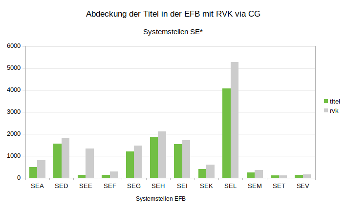

Bilddatei: [img/CG_RVK_DE-290-12_SE.png](img/CG_RVK_DE-290-12_SE.png)

## Systemstellen SF*

| **collection** | **titles** | **bundles** | **no bundle** | **quota bundles** | **rvk** | **no rvk** | **quota rvk** |
| -------------- | ---------- | ----------- | ------------- | ----------------- | ------- | ---------- | ------------- |
| **SF**         | 1.402       | 974         | 428           | 69,47             | 903     | 499        | **64,41**     |
| **SFA**        | 142        | 93          | 49            | 65,49             | 85      | 57         | **59,86**     |
| **SFB**        | 109        | 93          | 16            | 85,32             | 91      | 18         | **83,49**     |
| **SFC**        | 383        | 317         | 66            | 82,77             | 280     | 103        | **73,11**     |
| **SFK**        | 8          | 7           | 1             | 87,5              | 7       | 1          | **87,5**      |
| **SFL**        | 222        | 61          | 161           | 27,48             | 58      | 164        | **26,13**     |
| **SFM**        | 82         | 61          | 21            | 74,39             | 55      | 27         | **67,07**     |
| **SFN**        | 102        | 74          | 28            | 72,55             | 69      | 33         | **67,65**     |
| **SFO**        | 51         | 37          | 14            | 72,55             | 35      | 16         | **68,63**     |
| **SFP**        | 49         | 40          | 9             | 81,63             | 40      | 9          | **81,63**     |
| **SFQ**        | 82         | 61          | 21            | 74,39             | 57      | 25         | **69,51**     |
| **SFR**        | 51         | 36          | 15            | 70,59             | 36      | 15         | **70,59**     |
| **SFS**        | 17         | 11          | 6             | 64,71             | 10      | 7          | **58,82**     |
| **SFT**        | 62         | 44          | 18            | 70,97             | 43      | 19         | **69,35**     |
| **SFV**        | 42         | 39          | 3             | 92,86             | 37      | 5          | **88,1**      |

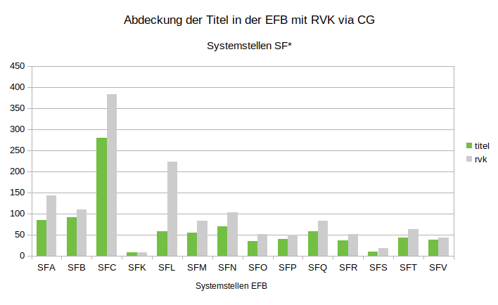

Bilddatei: [img/CG_RVK_DE-290-12_SF.png](img/CG_RVK_DE-290-12_SF.png)

## Systemstellen SO*

| **collection** | **titles** | **bundles** | **no bundle** | **quota bundles** | **rvk** | **no rvk** | **quota rvk** |
| -------------- | ---------- | ----------- | ------------- | ----------------- | ------- | ---------- | ------------- |
| **SO**         | 9.492       | 8.742        | 750           | 92,1              | 8.497    | 995        | **89,52**     |
| **SOA**        | 76         | 58          | 18            | 76,32             | 57      | 19         | **75**        |
| **SOB**        | 380        | 307         | 73            | 80,79             | 303     | 77         | **79,74**     |
| **SOC**        | 394        | 361         | 33            | 91,62             | 360     | 34         | **91,37**     |
| **SOD**        | 567        | 499         | 68            | 88,01             | 492     | 75         | **86,77**     |
| **SOE**        | 787        | 734         | 53            | 93,27             | 725     | 62         | **92,12**     |
| **SOF**        | 1.196       | 1.128        | 68            | 94,31             | 1.093    | 103        | **91,39**     |
| **SOG**        | 230        | 193         | 37            | 83,91             | 188     | 42         | **81,74**     |
| **SOH**        | 428        | 394         | 34            | 92,06             | 388     | 40         | **90,65**     |
| **SOI**        | 70         | 65          | 5             | 92,86             | 65      | 5          | **92,86**     |
| **SOJ**        | 260        | 242         | 18            | 93,08             | 240     | 20         | **92,31**     |
| **SOK**        | 1.151       | 1.051        | 100           | 91,31             | 1.032    | 119        | **89,66**     |
| **SOL**        | 229        | 220         | 9             | 96,07             | 213     | 16         | **93,01**     |
| **SOM**        | 164        | 152         | 12            | 92,68             | 150     | 14         | **91,46**     |
| **SON**        | 1.966       | 1.823        | 143           | 92,73             | 1.708    | 258        | **86,88**     |
| **SOO**        | 809        | 773         | 36            | 95,55             | 757     | 52         | **93,57**     |
| **SOP**        | 651        | 625         | 26            | 96,01             | 611     | 40         | **93,86**     |
| **SOQ**        | 71         | 58          | 13            | 81,69             | 57      | 14         | **80,28**     |
| **SOR**        | 44         | 41          | 3             | 93,18             | 41      | 3          | **93,18**     |
| **SOS**        | 19         | 18          | 1             | 94,74             | 17      | 2          | **89,47**     |

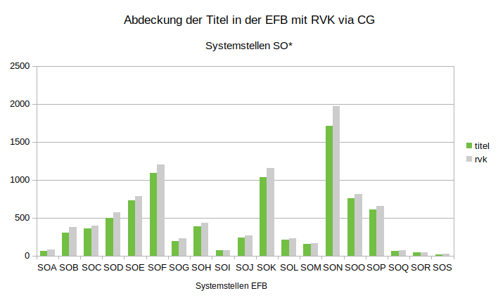

Bilddatei: [img/CG_RVK_DE-290-12_SO.png](img/CG_RVK_DE-290-12_SO.png)

## Systemstellen TE*

| **collection** | **titles** | **bundles** | **no bundle** | **quota bundles** | **rvk** | **no rvk** | **quota rvk** |
| -------------- | ---------- | ----------- | ------------- | ----------------- | ------- | ---------- | ------------- |
| **TE**         | 4.465       | 4.054        | 411           | 90,8              | 3.509    | 956        | **78,59**     |
| **TEA**        | 61         | 53          | 8             | 86,89             | 43      | 18         | **70,49**     |
| **TEB**        | 183        | 139         | 44            | 75,96             | 120     | 63         | **65,57**     |
| **TEC**        | 53         | 47          | 6             | 88,68             | 31      | 22         | **58,49**     |
| **TED**        | 209        | 188         | 21            | 89,95             | 165     | 44         | **78,95**     |
| **TEE**        | 232        | 222         | 10            | 95,69             | 207     | 25         | **89,22**     |
| **TEF**        | 148        | 145         | 3             | 97,97             | 134     | 14         | **90,54**     |
| **TEG**        | 148        | 139         | 9             | 93,92             | 130     | 18         | **87,84**     |
| **TEH**        | 626        | 584         | 42            | 93,29             | 472     | 154        | **75,4**      |
| **TEI**        | 242        | 221         | 21            | 91,32             | 205     | 37         | **84,71**     |
| **TEK**        | 532        | 519         | 13            | 97,56             | 476     | 56         | **89,47**     |
| **TEL**        | 320        | 299         | 21            | 93,44             | 253     | 67         | **79,06**     |
| **TEM**        | 888        | 785         | 103           | 88,4              | 713     | 175        | **80,29**     |
| **TEN**        | 284        | 262         | 22            | 92,25             | 218     | 66         | **76,76**     |
| **TEO**        | 63         | 63          | 0             | 100               | 53      | 10         | **84,13**     |
| **TEP**        | 9          | 8           | 1             | 88,89             | 8       | 1          | **88,89**     |
| **TEQ**        | 120        | 107         | 13            | 89,17             | 72      | 48         | **60**        |
| **TES**        | 135        | 87          | 48            | 64,44             | 67      | 68         | **49,63**     |
| **TEX**        | 212        | 186         | 26            | 87,74             | 142     | 70         | **66,98**     |

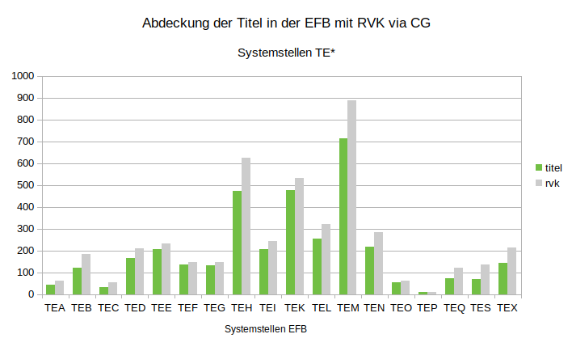

Bilddatei: [img/CG_RVK_DE-290-12_TE.png](img/CG_RVK_DE-290-12_TE.png)

## Systemstellen TH*

| **collection** | **titles** | **bundles** | **no bundle** | **quota bundles** | **rvk** | **no rvk** | **quota rvk** |
| -------------- | ---------- | ----------- | ------------- | ----------------- | ------- | ---------- | ------------- |
| **TH**         | 13.480      | 9.969        | 3.511          | 73,95             | 9.693    | 3.787       | **71,91**     |
| **THA**        | 292        | 133         | 159           | 45,55             | 129     | 163        | **44,18**     |
| **THB**        | 368        | 310         | 58            | 84,24             | 306     | 62         | **83,15**     |
| **THC**        | 562        | 418         | 144           | 74,38             | 396     | 166        | **70,46**     |
| **THD**        | 1.186       | 865         | 321           | 72,93             | 834     | 352        | **70,32**     |
| **THE**        | 2.015       | 1.703        | 312           | 84,52             | 1.674    | 341        | **83,08**     |
| **THF**        | 1.221       | 964         | 257           | 78,95             | 949     | 272        | **77,72**     |
| **THG**        | 2.032       | 1.134        | 898           | 55,81             | 1.103    | 929        | **54,28**     |
| **THH**        | 820        | 728         | 92            | 88,78             | 717     | 103        | **87,44**     |
| **THI**        | 1.042       | 793         | 249           | 76,1              | 776     | 266        | **74,47**     |
| **THJ**        | 389        | 357         | 32            | 91,77             | 344     | 45         | **88,43**     |
| **THK**        | 231        | 215         | 16            | 93,07             | 212     | 19         | **91,77**     |
| **THL**        | 701        | 612         | 89            | 87,3              | 599     | 102        | **85,45**     |
| **THM**        | 1.942       | 11.51        | 791           | 59,27             | 1.094    | 848        | **56,33**     |
| **THN**        | 679        | 586         | 93            | 86,3              | 560     | 119        | **82,47**     |

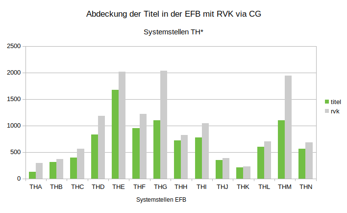

Bilddatei: [img/CG_RVK_DE-290-12_TH.png](img/CG_RVK_DE-290-12_TH.png)

---

This work is licensed under a [Creative Commons Attribution 4.0 International License](https://creativecommons.org/licenses/by/4.0/).
